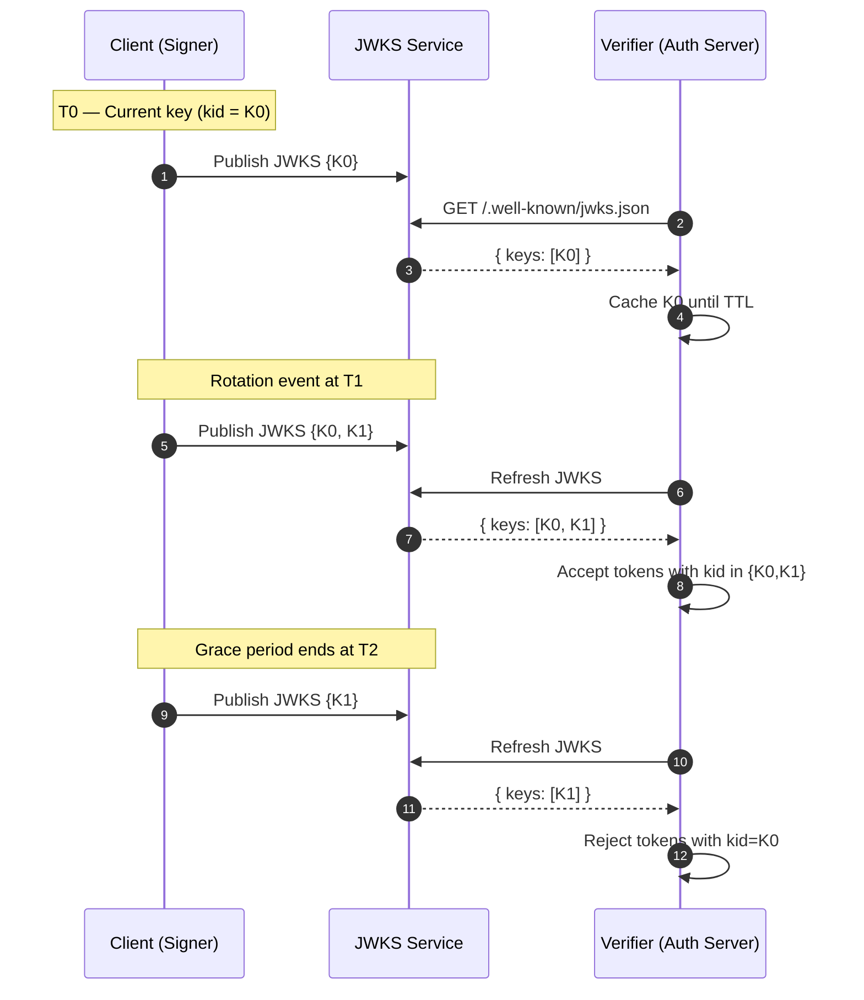
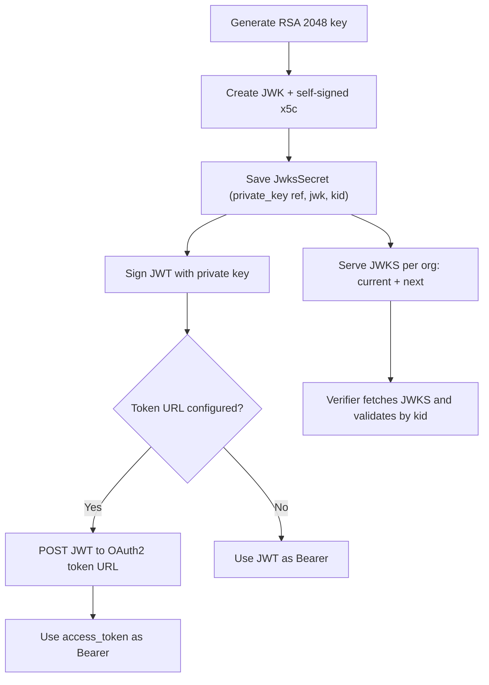

JWKS Auth signs JWT assertions using managed RSA keys and publishes the corresponding public keys via an org-scoped JWKS endpoint. You can use the signed JWT directly as a Bearer token or exchange it for an OAuth 2.0 access token. Keys rotate automatically, and the JWKS endpoint serves both the current and next keys during a configurable grace period to ensure seamless rollover.

## Authentication Options

### Direct authentication

1. Generate a JWT using the configured claims and the org’s current private key.
2. Sign the jwt token with the org’s current private key.
3. Use the signed JWT as `Authorization: Bearer <jwt>` in the request header `authorization`.

### Two-step (JWT → OAuth2 access token)

1. Construct and sign the JWT as above.
2. Exchange the JWT for an Access Token (optional). If a token request URL is provided, the JWT is posted to that URL and the returned access token is used. Otherwise, the JWT itself is used as the Bearer token

### Step 1: Org-Scoped JWKS Endpoint

Verifiers can fetch public keys from the org-scoped JWKS endpoint. The org is inferred from the first label of the Host header (org alias or mapped subdomain).

* Endpoint: `GET /.well-known/jwks.json`
* Host: `https://{{tenant_name}}.moveworks.com` (e.g. `https://acme.moveworks.com`)
* Success: `200 OK` with `{ "keys": [ JWK, ... ] }`
* Not found: `404` when no JWKS config exists for the org
* Bad request: `400` for missing/invalid host or org alias
* Rate limited: `429` when rate limit is exceeded

Example response:

```json
{
  "keys": [
    {
      "kty": "RSA",
      "kid": "current-key-id",
      "n":   "...base64url modulus...",
      "e":   "AQAB",
      "x5c": ["...base64 DER certificate..."]
    },
    {
      "kty": "RSA",
      "kid": "next-key-id",
      "n":   "...",
      "e":   "AQAB",
      "x5c": ["..."]
    }
  ]
}

```

### Step 2: How We Generate and Sign the JWT

* Key type: RSA 2048
* JWK fields: `kty`, `kid`, `n`, `e`, `x5c` (self-signed certificate, 1-year TTL)
* KID format: UUID, optionally prefixed when generated
* Claims: `iss`, `sub`, `aud`, `iat`, `exp` plus any additional claims
* Headers: Optional custom headers (e.g., `typ`) can be set

Example (Python) of how the system constructs and signs the JWT using the org’s current private key:

```python
import jwt
import time

private_key_pem = secret_store.get("Jwks Auth Private Key")  # referenced by JwksSecret
algorithm = "RS256"

claims = {
    "iss": config["Jwks Auth Claims Issuer"],
    "iat": int(time.time()),
    "exp": int(time.time()) + int(config["Jwks Auth Claims Expiry Seconds"]),
    **config.get("Jwks Auth Additional Claims", {}),
    **config.addtional_claims
}

if config["Jwks Auth Claims Audience"]:
	claims["aud"] = config.audience
if config["Jwks Auth Claims Subject"]:
	claims["sub"] = config.subject
if config["Jwks Auth Claims Scopes"]:
	claims["scope"] = ' '.join(config=["JWKS Auth Claim scopes"])

# The server-managed jwks KID is injected automatically. Don't put another separate kid into header
headers = { **config.get("Jwks Auth Headers", {}), 'alg': algorithm, 'kid': config.get("kid") }

jwt_assertion = jwt.encode(claims, config.private_key, algorithm=algorithm, headers=headers)
```

### Step 3: Exchange JWT for an Access Token (optional)

If a token request URL is configured, the JWT assertion is exchanged for an access token:

```bash
curl -X POST "$(config['Jwks Auth OAuth2 Access Token Request URL'])" \\
     -H "Content-Type: application/x-www-form-urlencoded" \\
     -d "grant_type=urn:ietf:params:oauth:grant-type:jwt-bearer" \\
     -d "assertion=$jwt_assertion"

```

A successful response typically looks like:

```json
{
  "access_token": "YOUR_ACCESS_TOKEN",
  "token_type": "Bearer",
  "expires_in": 3600
}

```

If no token URL is provided, the signed JWT is used directly as the Bearer token.

### Step 4: Use the Access Token in API Requests

```bash
curl -X GET "<https://api.example.com/data>" \\
     -H "Authorization: Bearer $ACCESS_TOKEN"

```

Where `$ACCESS_TOKEN` is either the exchange result or the signed JWT itself.

## Key Management and Rotation

* Storage: A `JwksSecret` stores a reference to the private key (in the secret store), the JWK JSON, and the `kid`.
* Publication: The JWKS service serves the union of current and next JWKs for the org at `/.well-known/jwks.json`.
* Rotation inputs: `rotation_interval` (days) and `rotation_grace_period` (hours).
* Grace period: both `current` and `next` are served during the grace window; verifiers must accept tokens signed by either `kid` until the grace window ends.
* System fields: `next_jwks` (populated automatically), `updated_at` (last rotation), `grade_period_ends_at` (end of grace window).

Mermaid timeline illustrating rotation and grace:



Flow overview of key issuance and use:



## Configuration Fields

To set this up:

1. Select `Jwks Auth` from the `Auth Config` dropdown.

2. Click the `Generate JWKS` button to generate the public and private key pair.

   

   <br />

3. Fill in the required fields:

   | Field                                     | Description                                                                                            |
   | :---------------------------------------- | :----------------------------------------------------------------------------------------------------- |
   | Jwks Auth Rotation Interval               | In days; how often to rotate keys.                                                                     |
   | Jwks Auth Rotation Grace Period           | In hours; both keys are served during grace                                                            |
   | Jwks Auth Claims Expiry Seconds           | This sets the `exp` claim at `iat + expiry_seconds`                                                    |
   | Jwks Auth Claims Issuer                   | Sent as `iss` claim                                                                                    |
   | Jwks Auth Claims Audience                 | Sent as `aud` claim                                                                                    |
   | Jwks Auth Claims Subject                  | Sent as `sub` claim                                                                                    |
   | Jwks Auth Headers                         | Optional JWT **header** claims such as `typ`.                                                          |
   | Jwks Auth Additional Claims               | Optional JWT **payload** claims like `scope`, `name`, `jti`                                            |
   | Assertion Key                             | Optional key used to pass the JWT assertion. If no key is specified, the standard 'assertion' is used. |
   | Jwks Auth OAuth2 Access Token Request URL | If provided, perform JWT bearer exchange.                                                              |
   | Jwks Auth Custom OAuth Request Options    | Optional overrides for the token request.                                                              |

   <br />

**Notes:**

* If the grace period is configured as 0, the system adds a small propagation buffer internally.
* The JWKS endpoint rate limits excessive requests and returns `429` when over limit.

## Implementation Notes

* JWKS endpoint: `/.well-known/jwks.json` (serves keys for the org derived from the Host header subdomain).
* Input config: org-scoped JWKS public keys are provided via a reloadable config; the endpoint parses and returns them in the standard JWKS format.
* Key format: RSA 2048 with `x5c` including a self-signed certificate (1-year TTL).
* Rotation: The platform maintains `current` and `next` keys in config and surfaces both during grace to support seamless rollover.

## Verification Guidance

* Always select the verification key by the JWT `kid` header.
* Cache JWKS responses per your policy, but refresh on signature failures or at reasonable intervals.
* During rotation, accept tokens signed with either the current or next `kid` until the grace period ends.
* If you see `404` from the JWKS endpoint, verify that the org alias is correct and that JWKS is configured for the org.

## Troubleshooting

* 400 invalid host or missing org alias: Ensure requests include a Host header like `<org-alias>.moveworks.com`.
* 404 no JWKS config: The org has no JWKS configured; configure `JwksSecret` and `Jwks Auth` first.
* 429 rate limit exceeded: Back off and retry with exponential backoff.
* Parsing errors in keys: Ensure JWK JSON follows spec (`kty`, `kid`, `n`, `e`, optional `x5c`).
